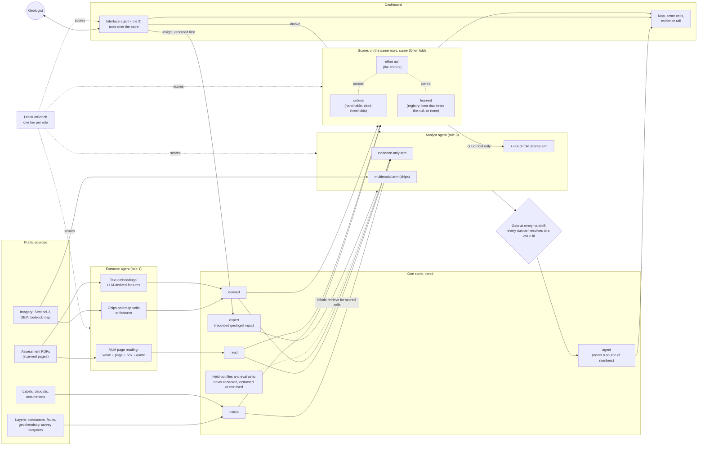
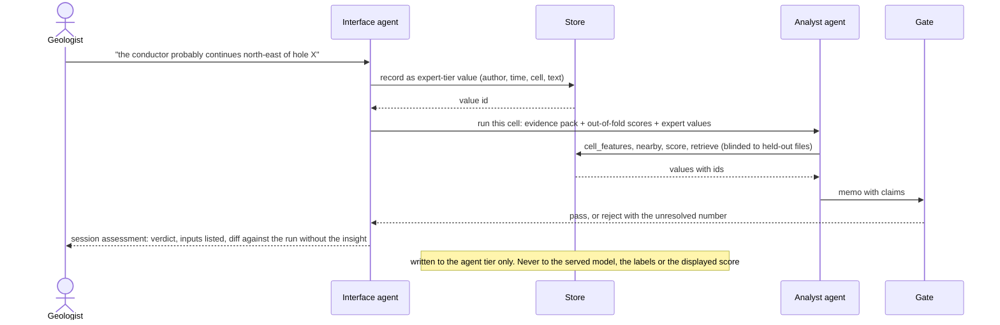
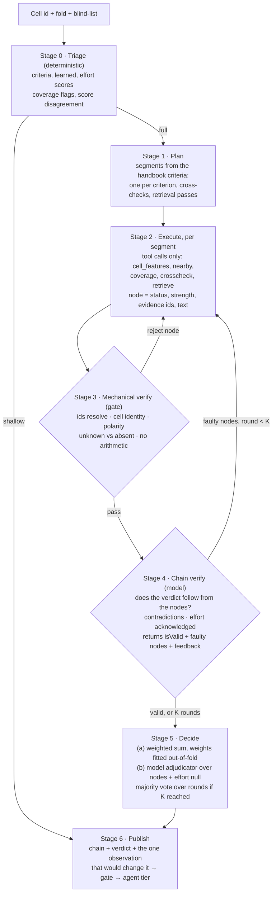

# AI Uranium Explorer — Product Requirements

**Status:** draft v0.1 · 2026-09-19 · owner: Charlie
**Scope:** turn the demo into a working prototype that a geologist could use and an engineer could scale.
**How to read:** FINDINGS.md holds the measured results that changed the claims. §1–9 set the frame; §6 is the architecture in two diagrams, §7 the bias and leak register, §8 the
three agents, and §9 the boundary of what this prototype will actually run. §A–E are the five workstreams, each with *current state → requirement →
how we will know → open questions*. §12 is the order we do them in. We go deeper into one section at a time
after this document is agreed.

---

## 1. The product, in one sentence

An evidence-grounded system that turns public uranium exploration records into scored ground, and lets a
geologist interrogate any score through an agent that can only speak from the evidence that produced it —
with every number traceable, every model validated against a null, and every agent claim mechanically checked.

## 2. Demo → prototype: what actually changes

| | Demo (today) | Working prototype (this PRD) |
|---|---|---|
| Serving | static JSON exports + a stdlib HTTP server on localhost | a real API and database; multi-user; deployable |
| Data | 20 registered sources, 4 gaps, one-off pulls | owned catalogue with lineage, refresh, versioning, and a decided position on every gap |
| ML | three scores, one validation run, one learner | an experiment programme: tracked runs, a model registry, bias-corrected validation, reported with intervals |
| Agent | one configuration, one synthetic eval | a benchmark over our own data; several configurations compared; the best one chosen by measurement |
| Tools | six Python functions behind a custom loop | a tool contract exposed over MCP, usable from our UI *and* from a geologist's own client |
| Trust | a fabrication gate measured on synthetic corruption | the gate at every boundary, measured on organic outputs, with a human-adjudicated denominator |

**Definition of "working":** a geologist unfamiliar with the code can open the app, pick a cell, read why it
scored what it scored, ask three follow-up questions, get answers whose every number they can click through
to its source, and be told plainly when the system does not know. An engineer can reproduce every score and
every agent answer from a versioned input, and can deploy the whole thing on a fresh machine from one command.

## 3. Who it is for

| User | Their job here | What they need from us |
|---|---|---|
| **Exploration geologist** | decide whether a cell deserves a closer look | evidence they can see, unknown kept apart from absent, the next observation that would change the answer |
| **Exploration manager** | allocate a finite programme across ground | search-space reduction paired with capture rate; a ranking that discloses how much of it is exploration history |
| **AI/ML engineer** | build, validate and scale the LLM system | reproducibility, benchmarks with denominators, an architecture that survives 10× the data |

## 4. Standing constraints — carried over unchanged

- Public data only; no logged-in sites, no paid data, no scraping behind logins; dataset licences respected;
  report PDFs (no named licence) read locally and never redistributed.
- The mineral dispositions layer is never loaded. Held-out files are never rendered, extracted or labelled.
- No drill targets, no prospectivity language, no grade or tonnage estimates. Verdicts top out at
  *supports a closer look*.
- **Every number on screen resolves to a stored value id.** Colour encodes source or status, with the one
  declared exception for score cells.
- Provenance tiers stay: `native` (as published) / `read` (model-read, unvalidated) / `derived` (computed,
  inputs recorded) / `agent` (argued, never a source of numbers).
- A model never computes: no arithmetic, distances, conversions or percentages outside a tool.
- Nothing invented to fill a gap. A missing dataset is named on screen, not smoothed over.

## 5. Where we are — the facts the plan starts from

- **Store:** 30,534 cells · 732,816 feature values across 24 features (18 geological, 6 exploration-effort) ·
  30,534 labels (60 deposit, 620 occurrence, 29,854 unlabelled) · 64,131 scores · 305,340 criterion
  memberships · 116 metrics · 27 memos with 188 claims.
- **Corpus:** 1,534 in-area assessment files at metadata level, 1,846 pages read, 22 of 60 target PDFs fetched.
- **Sources:** 21 registered, 19 redistributable, 4 recorded gaps (aeromagnetic grids, now *published, not
  pulled* after F2; discovery dates; EM conductor attributes; alteration measurements).
- **Headline measurement, Phase 0 done (FINDINGS.md F1):** under spatial folds the effort-only model reaches
  PR-AUC 0.346 against 0.133 for the geology model, and after matched background and thinned positives it is
  still ahead, 0.178 against 0.111, intervals separate, on both label sets. **Confirmed, not an artefact.**
  Effort alone ranks the 60 deposit cells at ROC-AUC 0.90 to 0.95; the geology model does not transfer across
  camps. Thinning showed a third of effort's apparent skill was counting one camp many times.
- **Gate:** 224 of 232 corrupted claims refused, 0 of 128 true claims wrongly refused (re-run 2026-09-20 on the 22-report evidence packs; 210 of 223 and 0 of 90 on the first four) — on synthetic corruption
  only. Two named holes: a correct value from the wrong cell passes; negated evidence passes.
- **Stack:** Python 3.13 / uv / typer / DuckDB / scikit-learn / rasterio / pystac; React 19 / Vite 8 / TS 6 /
  Tailwind 4 / MapLibre 6 / zod 4 / zustand; Claude Code headless and an OpenAI adapter with a spend ceiling.
- **Known defects** (from `research/06`): metric mismatch vs MineTRACE, gate only at publish, homogeneous
  panel, cache key omits the system prompt, thin page-tier retrieval, no gold labels.

---

## 6. How the pieces fit

Three agents, one store, three scores and one control. The **extractor** turns pages, chips and text into
values that land in the store under their own tier. The **criteria**, **learned** and **effort** scores are
computed over the same rows under the same spatial folds; effort is the control the other two are read
against, and the served learned model is the best one that beats it — or none. The **analyst** reads a cell's
evidence and is scored against the same labels as the models, with retrieval blinded to the files that would
give the answer away. The **interface** talks to the geologist, calls tools over the store, and can invoke the
analyst. Every number that crosses a boundary passes the gate. Nothing an agent says is ever a source of
numbers, and nothing said in a session is ever written back to the served model, the labels or the map.

**A live reading** is what happens when the geologist adds something the store does not hold. The insight
becomes a value first, so the analyst can cite it; the run is then the ordinary analyst over the evidence
pack plus the expert-tier values, gated like any other, and reported beside the run without the insight.

---

## 7. Bias and leak register

Every way this system could look better than it is, written down so each one can be attacked in turn. An
entry moves to *handled* only when a test in the repository demonstrates the fix. **Status:** open · partly ·
handled.

**Labels and sampling**

| Id | Bias or leak | Where it enters | What it would do | How we detect it | How we would fix it | Status |
|---|---|---|---|---|---|---|
| B1 | Exploration-effort confound | labels exist where people drilled; features are measured where people looked | any model learns *where people went*, and reports it as geology | the effort-only null on the same rows; capture stratified by effort decile | effort-adjusted metrics; PU negatives sampled at matched effort; report every score beside the null | partly |
| B2 | Label crossover from naive PU sampling | unlabelled cells treated as negatives | shrinks the positive area, inflates variance, depresses the geology model most | Phase 0 re-test (§C.2.1): matched background moved the geology model by 0.001; the headline held | measured and reported (FINDINGS.md F1); reliable-negative selection stays a Phase 3 candidate | handled |
| B3 | Spatial autocorrelation leakage | random cross-validation | neighbouring cells in train and test; metrics inflate | gap between random, spatial and camp folds | spatial blocks fixed before the first fit; camp holdout; all three reported | handled |
| B4 | Label definition bias | deposit vs occurrence; compiler-dependent definitions in SMDI | "positives" mix ore bodies with a single radioactive boulder | metrics reported deposits-only and with occurrences | both label sets kept; base rate stated beside every number | partly |
| B5 | Camp clustering | deposits sit in a handful of camps | a model memorises camps and looks skilled | leave-one-camp-out fold | camp fold is one of the three standard folds | handled |
| B6 | Cell size and areal unit | the 2 km grid was chosen, not derived | results that only hold at 2 km | 1 km and 5 km sensitivity (§C.2.2) | report the sensitivity run beside the headline | open |
| B7 | Class-imbalance metric flattery | ROC-AUC at 1:500 | a model that ranks background well looks excellent | PR-AUC and capture at 10% of area with the base rate | never compare across protocols (MineTRACE's 30/200 is not ours); PR-AUC first | handled |

**Features, coverage and provenance**

| Id | Bias or leak | Where it enters | What it would do | How we detect it | How we would fix it | Status |
|---|---|---|---|---|---|---|
| B8 | Coverage is not random | surveys were flown where interest was; 9 of 17 features cover 40% or less | missingness itself predicts the label | missingness-vs-label correlation; readiness scorecard | missingness indicators counted as *effort* features; area-of-applicability mask; metrics per coverage stratum | partly |
| B9 | Survey vintage and method drift | EM systems, detection limits and sampling density changed over decades | old ground looks quiet; new ground looks anomalous | feature value vs survey year | survey year and system as effort features; per-survey normalisation | open |
| B10 | Censored geochemistry | below-detection values reported as half the limit or zero | false thresholds in the criteria; distorted anomalies | detection limit recorded per sample | censoring-aware summaries; detection limit stored beside the value | open |
| B11 | Folklore in the criteria table | thresholds and weights taken from textbooks written about the same camps that supply the labels | circular skill: the criteria describe the known deposits | criteria score on camp holdout; folklore rows at weight zero | every threshold cited; fitted-weights arm evaluated on held-out camps only | partly |
| B12 | Text-length bias | mineralised areas have longer, richer reports and map descriptions (Parsa et al. 2025) | LLM-derived features read effort through the text channel | text length vs label; a length-only null | length-normalised embeddings; length itself filed as effort | open |
| B13 | Corpus survivorship | assessment files are filed by holders who kept ground; the fetched subset was chosen by interest | the corpus over-represents success | fetch selection recorded; compare fetched vs unfetched by NTS sheet | sample files by sheet, not by interest; record the selection rule | open |
| B14 | Compilations as they stand today | deposit and occurrence compilations include post-discovery work | retrodiction sees the future | the dated hindcast with a cut-off (§C.2.3), run 2026-09-19 (F4) | labels and drilling frozen at the cut-off; the geological compilations cannot be, and every row says so | partly |

**Imagery and text**

| Id | Bias or leak | Where it enters | What it would do | How we detect it | How we would fix it | Status |
|---|---|---|---|---|---|---|
| B15 | Effort visible in imagery | cut lines, camps, drill roads and clearings in Sentinel-2 chips | a vision model learns to spot roads and calls it geology | chip-only model vs the effort null; saliency over cleared pixels | mask clearings and roads; ablation with and without; state as a limit if it cannot be removed | open |
| B16 | Cloud and season | cloud pixels once counted as valid ground; snow and leaf-on differ by scene | features that encode acquisition date | cloud mask audit; per-scene date recorded | scene date and cloud fraction stored; composite over a fixed window | partly |

**Agent, retrieval and gate**

| Id | Bias or leak | Where it enters | What it would do | How we detect it | How we would fix it | Status |
|---|---|---|---|---|---|---|
| B17 | Retrieval leakage | the assessment file for a deposit cell says mineralisation was intersected | the analyst reads the answer instead of the evidence | analyst with and without retrieval; citations checked against the held-out file list; a "read the label from the report" baseline | blind retrieve to held-out files for the scored cell and its neighbours; date cut for hindcast | open |
| B18 | Score leakage into the analyst | **live today**: `cell_scores` returns learned and effort scores fitted on every cell, as its own note says | the analyst inherits the fit and is scored on the same labels | the model version and fold the analyst saw are logged per run | out-of-fold scores only; the arm reported beside "copy the score" and the evidence-only arm | open |
| B19 | Expert anchoring | a geologist's insight steers the analyst; the geologist then sees agreement | a confirmation loop dressed as a live reading | diff between runs with and without expert-tier values; adversarial wrong-insight items | insight recorded first, labelled as expert-tier in the memo; never written back; reported with the diff | open |
| B20 | Homogeneous panel | all roles on one model family | correlated errors; a skeptic that agrees with itself | heterogeneous arm (§D.3.3) | different families per role; mechanical checks over LLM judges | open |
| B21 | Gate blind spots | right number from the wrong cell; negated evidence; small round numbers in quotable text | fabrication that resolves | adversarial tier 3; organic gate measurement | cell-identity binding; polarity and unit normalisation; gate at every handoff (§D.3.5) | partly |
| B22 | Stale cache | cache key omits the system prompt and schema | an old answer evaluated as a new configuration | byte-identical recordings after a prompt change | system prompt and schema in the key before any benchmark run | open |
| B30 | The cell's own label in the evidence pack | `label_context` returns "occurrence at 0.0 km" for a labelled cell | the analyst reads the answer off the pack | any scored run where the pack contains a label at 0 km | mask the evaluated cell's own label in scored runs; keep it in the dashboard | open |
| B23 | Compute asymmetry between configurations | a panel makes more tool calls than a single agent | more evidence, not better reasoning, wins | calls and cost per answer logged | matched compute budget per configuration (§D.3.3) | partly |

**Evaluation and people**

| Id | Bias or leak | Where it enters | What it would do | How we detect it | How we would fix it | Status |
|---|---|---|---|---|---|---|
| B24 | Benchmark authorship | we write the questions, the rubric and the configurations | a benchmark tuned to what we already do well | benchmark frozen before configurations are tuned; a held-out question split | tier 3 grows only from production failures; the frozen version is the one reported | open |
| B25 | Single rater who built the system | the geologist-day is one person, and the reasoning tiers are rated by the author | ratings drift toward the design | configuration labels blinded; order randomised; reported as one rater | the geologist-day (§D.3.4) with chance-corrected agreement | open |
| B26 | Judge shares a family with the judged | LLM-as-judge on rubric items | the judge forgives its own habits | judge and judged from different families; mechanical items first | rubric items that can be checked by code are; the rest rated by a person | open |

**Interface and dashboard**

| Id | Bias or leak | Where it enters | What it would do | How we detect it | How we would fix it | Status |
|---|---|---|---|---|---|---|
| B27 | Score before evidence | the map shows a coloured cell before the geologist sees why | anchoring on the colour | usage: evidence opened before or after the score | evidence-first mode; the effort score one click from every learned score | open |
| B28 | Colour ramp | low cells invisible or nudged toward attention | the ramp editorialises | the declared colour exception and its test | ramp reviewed with the geologist; the exception stays the only one | partly |
| B29 | Wording drift | "prediction", "target", "potential" creep into copy and names | the product claims skill it has not shown | the forbidden-phrases test | verdicts top out at "supports a closer look"; live readings are readings, not predictions | handled |

---

## 8. The agentic system — three agents, one runtime

Three agents, one runtime, one gate. Each agent is a loop over the same tool contract, and the gate is
middleware that runs at every handoff, not a check at the end. The analyst design starts from MineAgent and
STA-CoT, translated from images to a structured evidence record; neither is ground truth, both are the
only measured starting points.

### 8.1 Shared runtime (must)

- **One tool contract** over MCP (§E.3): every tool returns values with ids, every call is traced with its
  arguments, result ids, cost and latency. A model never computes; a tool always does.
- **Gate as middleware**: every message that crosses an agent boundary (tool → agent, agent → agent,
  agent → store, agent → screen) is checked for number-to-id resolution, cell identity and polarity before it
  is passed on. A rejected message goes back to its producer with the unresolved number, never forward.
- **Run manifest** per invocation: prompt versions, model per role, fold and model version of every score the
  agent saw, retrieval blind-list, seed, budget. A run is replayable from its manifest and the cache; the cache
  key covers system prompt and schema (closes B22).
- **Budgets** per run and per configuration, checked before each call, with the spend ledger already built.
- **Tracing** with OpenTelemetry so the benchmark can compute per-stage metrics from the traces, not from logs.

### 8.2 Extractor agent — reading loop (must, with §B and §C)

For each page or chip: locate → read under a schema → validate → file under `read`.

1. **Locate**: layout and OCR where a text layer is missing; page, box and verbatim quote recorded for every
   candidate value (already the contract for the 1,846 pages read).
2. **Read**: a VLM call constrained to the value schema for that page type (collar, assay interval,
   lithology log, legend, map unit). Output is a set of candidate values, each with quote and box.
3. **Validate**: deterministic checks — CRS and datum, units, physical ranges, the quote located on the page,
   collar within the claim block. A value that fails stays flagged and never becomes a feature.
4. **Agree**: a second read by a different model family; values the two readings disagree on go to a review
   queue with both readings shown. Agreement rate is a tracked metric.
5. **File** under `read` with reader model, prompt version and validator results, so §C can choose which
   readings feed a feature.

Scored by Tier 4 against hand-keyed gold; the published bars are in §D.3.1.

### 8.3 Interface agent — router (must, with §E)

The chat panel. It adds no signal; it finds, explains, records and invokes.

- **Intent router** over a fixed set of question kinds: lookup, compare, explain a score, what is unknown
  here, what would change the reading, record an insight, run the analyst. Unrouted questions go to a plain
  tool loop capped at a small number of calls.
- **Explicit abstain tool.** GeoBenchX showed refusal is only measurable when there is a tool to call; ours
  returns the reason (not measured here, outside the grid, would need a value the store lacks).
- **Record insight**: writes a geologist's statement to the `expert` tier with author, time and cell, and
  returns its id. Only then can any agent cite it.
- **Invoke analyst**: hands over the cell, the out-of-fold score ids, the expert-tier ids and the reason for
  invoking; receives a gated chain and reports the verdict with the diff against the run without the insight.
- Scored on tiers 1–3 and by the MineTRACE rating protocol (§D.3.1, §D.3.4).

### 8.4 Analyst agent — multi-step reasoning over the evidence record (must)

MineAgent judges each *image* and aggregates; STA-CoT plans, executes each step against a *target area*, and
verifies the chain. We judge each **criterion**, execute each step against the **cell and its neighbourhood**,
and verify the chain twice: once mechanically, once with a model.

**Stage 0 — Triage.** Deterministic and free. Computes the three scores, the effort null, coverage and the
disagreement between them for the cell. Decides depth: a cell where all scores agree and coverage is full may
take the shallow path (a single gated summary); disagreement, gaps or an expert-tier value force the full
chain. GeoDecider's design: numerical prediction first, tool-assisted reasoning only for the hard intervals.
Whether triage is used at all is a configuration, because it is also a place to hide cost.

**Stage 1 — Plan.** The handbook and the criteria table are K_domain; the tools are T_set. The plan is a
list of segments: one per criterion (conductor distance, conductor density, fault distance and intersections,
graphitic host, unconformity depth, lake sediment conditioned on sampling density, lake water with pH and Eh,
boulder field with up-ice corridor, alteration where measured), then cross-checks (conductor ∧ fault,
geochemistry ∧ sampling density), then retrieval passes with the queries to run. A fixed template is the
"without planner" arm; a model planner may reorder, add retrieval queries and drop criteria the coverage flags
mark unmeasurable.

**Stage 2 — Execute.** One call per segment on the cheap model. The executor may only call tools and must
return a **node** in the fixed protocol: criterion, status ∈ {met, not met, unknown}, strength 0–5, the value
ids that support it, one sentence, and `depends_on`: the nodes it builds on (a criterion node depends on
nothing; a cross-check node names the criterion nodes it combines). This is MineAgent's communication protocol,
and the component their ablation shows carries the gain (Pos.F1 32.5 without it, 61.2 with). `nearby(cell,
layer, radius)` is our box maker; `crosscheck` is our spatial-relationship explorer; both are deterministic.
A criterion executor sees only its segment and the tools; a cross-check executor sees the nodes it names.
Whether an executor also sees the whole chain so far (STA-CoT's memory cache, the "Previous Analysis" its
executor prompt receives) is a switch, `executor_context = independent | cumulative`, because that is the
path an early error takes into later nodes in their own case study (a step 5 built on a wrong step 2).

**Stage 3 — Mechanical verify.** The gate on every node: every number resolves to an id returned in this
run, the id carries the cell in question or a declared neighbour, polarity matches (a "not met" node cannot
cite evidence the handbook lists as favourable without saying so), unknown is used only where coverage says
unmeasured, and no arithmetic appears. A rejected node goes back to Stage 2 with feedback that escalates the
way STA-CoT's rule controller does (its Appendix C.2): the first time, the reason; the second time, the reason
and the ids the node may cite; the last time, explicit instructions and permission to return unknown. A node
that fails the last time is recorded as unknown with the gate's reason, never dropped. Free, so it runs every
time.

**Stage 4 — Chain verify.** One call per chain on the strong model, with the skeptic's brief: does the
verdict follow from the nodes, do any nodes contradict, is the effort null acknowledged, is a folklore
criterion carrying weight, is proximity to a known deposit doing the work. Returns isValid, the faulty node
ids and corrective feedback; the faulty nodes and every node that depends on them are re-executed and the
chain re-verified, up to K rounds. The verifier also returns its own candidate label, as STA-CoT's does (their
verifier emits the candidate answer beside isValid and the feedback); ours is recorded, not acted on, so the
agreement between the verifier's label and the deciders' is a per-stage metric. STA-CoT's finding that the
verifier is where capacity pays is why the executor is the cheap model and the verifier the expensive one, and
why that pairing is a configuration: on MineBench (Avg.F1) a weak executor under a strong verifier scores
73.72, the reverse 48.80, both strong 80.75, both weak 35.48 (their Figure 3).

**Stage 5 — Decide.** Two deciders, always both, compared:
(a) a **weighted sum** over node strengths with weights fitted on training folds only — MineAgent's decision
module and MineTRACE's fitted expert weights, and the fitted-weights criteria arm of §C in one place;
(b) a **model adjudicator** reading the nodes and the effort null, producing the three-level verdict
(evidence against / insufficient / supports a closer look), the unknown-vs-absent list and the one observation
that would change the reading. For the benchmark's binary question, (a) supplies a calibrated score and (b)
supplies a label. If K rounds were exhausted, the label is the majority over the K rounds' candidate labels,
STA-CoT's fallback vote (their Algorithm 2): a vote over the rounds of one repair trajectory, not over
independent samples, which is the separate self-consistency switch in §8.5. A chain that never validates and
has no majority publishes *insufficient evidence* with the verifier's last feedback as the reason, counted as
an abstention with its denominator. It is never a hard failure: by their Algorithm 2 such a chain returns
"Failed", which is where the −31.6 Pos.F1 without the vote (35.05 against 66.67, their Table 3) comes from.

**Stage 6 — Publish.** The chain, the verdict and its inputs go through the gate once more as a whole and
land in the `agent` tier with the run manifest. Nothing here is a source of numbers.

**Leakage controls, enforced by tests, not policy**: the scores in Stage 0 and Stage 5 are out-of-fold for
the cell's block (B18); `retrieve` refuses files on the blind-list for the cell and its neighbours (B17);
expert-tier ids are labelled as such in every node that cites them (B19); `label_context` masks the
evaluated cell's own label and any label inside it in scored runs (B30), while the dashboard keeps showing
it, because the nearest known occurrence is the first thing a skeptic should ask.

### 8.5 Ablation matrix — the configurations §D compares (must)

Each row is one switch on the loop above, run on the same frozen benchmark at matched compute. The matrix
replaces the six configurations formerly listed in §D.3.3.

| Switch | Arms | What it tests |
|---|---|---|
| Triage | off / on | whether the shallow path loses correctness for the cost it saves |
| Planner | fixed template / model | STA-CoT's −14.6 Pos.F1 without a planner — does it hold on structured evidence |
| Executor | single shot over the whole pack / per segment | STA-CoT's −56 without an executor; ours is where the protocol lives |
| Mechanical gate | off / on | the free layer; the only arm allowed to publish is "on" |
| Chain verifier | none / neutral / skeptic brief | STA-CoT's −29 without a verifier; the skeptic brief is today's panel |
| Model pairing | cheap executor + strong verifier / strong both / reverse | the executor–verifier trade-off |
| Executor context | independent / cumulative | STA-CoT's memory cache: whether later nodes may read earlier ones, the path an early error takes |
| Unmeasured criteria | asked / settled by the harness (`skip_unmeasured`) | a quarter of executor calls answer a question the coverage row already answers; the harness writes the unknown node, gated like any other, for no call |
| Executor batch | per segment / one call for every criterion, gated node by node (`executor_batch`) | the "single shot" arm: ten calls become one plus the retries of the nodes the gate refuses |
| Decider | weighted sum / adjudicator / both | fitted weights vs judgement |
| Rounds K | 1 / 3 | repair vs cost |
| Self-consistency | n = 1 / 5 with vote | majority vote as a fallback vs as a default |
| Retrieval | off / on / on with blind-list | B17, measured |
| Families | homogeneous / heterogeneous across roles | B20 |
| Baselines | random · copy the learned score · criteria · learned · effort null · single-shot model with no tools | the rows every arm must beat |

Per-stage metrics from the traces: node rejection rate at Stage 3, verifier catch rate and rounds-to-valid
at Stage 4, agreement between the two deciders at Stage 5, calls and cost per chain, and the correctness of
each arm against the labels with the effort null on the same row.

---

## 9. Scope boundary — what this prototype will actually run

Data first, then two focused tasks, then a backlog. The extractor cannot read the corpus and the analyst
cannot read the grid: the numbers below say why, and what fits instead.

### 9.1 Data readiness gate (must, before any agent phase)

No agent phase starts until every dataset the focused tasks depend on is green on all five columns. The
checklist is a command, `lr prospect gate` (2026-09-19): one row per feature layer or scene, label layer and
enabled-cell assessment file, five ok/not-yet cells with a note each, exit code red on any failure, and the
same table on the dashboard's data page. This is the rule and the current picture.

| Column | Meaning | Where we are (2026-09-19) |
|---|---|---|
| **Present** | in the store under its tier, row counts known | 11 layers, 56 scenes registered, 1,534 corpus files at metadata level, 24 features over 30,534 cells |
| **Licensed** | redistributable, or read locally and never served | 18 of 20 sources redistributable; report PDFs local only |
| **Covers** | share of the grid with a value, stated per feature | 9 of 17 geological features cover 40% or less |
| **Servable** | exportable to the dashboard within its licence and size | 8 evidence layers exported; scores as a layer; imagery features not yet built |
| **Versioned** | a hashed pull that a value walks back to | every layer hashed and registered; store snapshots (`lr store snapshot`); each evaluation run names the snapshot it read |

**What has been read so far, and whether it is enough.** Reading is a pre-processing step done offline on
the Claude Code headless backend, cached and resumable; it is never done at request time.

| Read tier today | Count | Where it sits |
|---|---|---|
| Reports fully read (VLM, every value with page, box, quote) | 22 — the four of Phase 2 (Uranerz 1979, Cree Lake 2005, Conwest 1978, Cameco Park Creek 1998) plus all 18 enabled-cell drilling files read on Opus (2026-09-20, F5) | all `dev` split; the 18 sit in the enabled deposit, occurrence and demo cells |
| Pages the router sent to the model | 42 of the 4 reports' 691 pages (**6%**); plus 208 of the 212 planned over the 18 enabled files on Opus (2026-09-20, FINDINGS F5; 4 pages on the give-up list) | collar, assay and lithology tables; 252 pages read in all |
| Values read | 28,169 field values in 1,969 records over 252 pages; 393 placed collars, 612 provincial matches (2026-09-20) | 5,141 validator outcomes — the `read` tier is unvalidated by design; 74G07-0064 alone carries 1,140 findings |
| Text-indexed pages (no model) | 13,945 pages from 966 documents in 35 files, 3,718 of them from the Apple Vision OCR pass (2026-09-20) | every enabled cell, deposit cells included |

Verdict (2026-09-20): **the enabled cells are text-indexed in full, their top drilling files are read on Opus
at box level, and the gate is green.** Every score is computed from `native` layers alone (all 24 features),
so the deterministic and learned analyses need no reading at all. Reading matters for the evidence the
analyst and the dashboard show on the enabled cells, and that evidence now exists for all 15 (FINDINGS F5);
$79 of Opus at list price, 6.3 hours of model time.

The four recorded gaps (aeromagnetic grids, discovery dates, EM conductor attributes, alteration measurements)
are decided in Phase 2, each as *filled*, *substituted* or *stated as absent on screen*. Sentinel-2 and DEM
features are **not** required by the focused tasks below and move to the backlog with the multimodal arm.

### 9.2 Why the whole corpus and the whole grid are out

Measured on this machine, from the run manifests and the store:

| Quantity | Measured | Full scale | Verdict |
|---|---|---|---|
| Reading, pages per hour | 42 pages in 3,012 s of model time, about **73 s per page**, in 41 calls | 1,534 files at 30–100 pages each is 50,000–150,000 pages, so 1,000–3,000 hours | **out** |
| Reading, usage per page | the run's own accounting: **$0.14-equivalent per page**, 391,592 output tokens for 42 pages | 50,000 pages is $7,000-equivalent of subscription usage | **out** |
| Analyst, calls per cell | 3 per cell today (panel); the §8.4 loop is about **13** (10 segments, verifier, adjudicator, publish) | 30,534 cells is 400,000 calls per configuration | **out** |
| Analyst, wall time | chat-length calls run 15–30 s on the headless backend | 120 cells × 13 calls is 1,560 calls, **6–13 hours per configuration**, unattended | in, bounded |
| OpenAI | $0.00 of the $2.00 test ceiling spent | reserved for the chat UI, as agreed | unchanged |

### 9.3 Focused task 1 — Reading, pre-done offline for the enabled cells (extractor)

The corpus is already positioned where it matters: **184 assessment files sit inside 53 of the 60 deposit
cells** (5,035 drillholes), 314 inside 189 of the 620 occurrence cells, and 294 within 3 km of a deposit cell.
The current fetch rule (the 60 files with the most holes) lands 27 in deposit cells and 7 in occurrence cells,
which is exactly the survivorship bias B13 names.

- **Enabled cells first.** The dashboard's analyst-enabled set (§9.4) is chosen before any reading, and the
  reading is bounded to the files inside those cells. Proposed list of **15**: the five cells the panel and
  recorded chat already use (Horseshoe 0201_0072 and four unlabelled cells chosen for score disagreement,
  gap and background); the four cells of the reports already read; and two deposit cells per camp with the
  fewest files that still carry drilling — Colette 0030_0081 and Dominique-Peter 0031_0088 in the west,
  0037_0049 and R780E 0033_0047 at Patterson Lake South, Deilmann 0145_0019 and Horseshoe 0200_0072 in the
  east. Frozen and versioned with its selection rule in Phase 2.
- **Fetch and index everything in the enabled cells, read almost nothing.** All 47 files inside the 15
  enabled cells are downloaded and text-indexed with no model calls, so the analyst has the page tier
  (quotable, numbers not allowed) and the metadata tier ("six files exist here, two were read") for every
  file. Only the **top two drilling files per cell** are model-read: 21 files, of which 4 are done, about 230
  routed pages, under 5 hours. Four enabled cells have no file at all, and "no report exists" is their honest
  state.
- **Order, decided 2026-09-19.** The pre-read lands in Phase 2, before the first analyst results, so
  the analyst's first chains on the enabled cells already carry the unknown-versus-absent evidence.
- **Why not more.** A few reports prove the mechanism (four exist). One or two per cell make each enabled
  cell's verdict honest. Reliable negatives for the learned model need hundreds of cells, which tens of files
  do not reach either, so that is backlog whatever we read now. There is no useful middle.
- **Route, then read — one page image per call, never a report.** Every fetched page is text-indexed or
  OCR'd for free; the router classifies each page by keywords and table shape with no model call; at most 12
  routed table pages per file are then sent **one page image at a time** with the schema for their class, and
  every returned quote is located on the page and validated before it is filed. The router already sends
  about 6% of pages to the model (42 of 691). This is a batch job on the headless backend, not an agent:
  no tool loop, no conversation. The interface and analyst agents never open a PDF; `retrieve` reads the
  index and the filed values.
- **Prototype on Claude Code headless, production on an API.** Every call already goes through the
  `Backend` protocol, so the swap is configuration — except that the OpenAI backend has no image input
  yet, so the extractor cannot run on it (backlog, §9.6). At API prices the bounded read is cheap: about
  9,300 output tokens per page measured, roughly $0.02–0.03 per page on gpt-5-mini, so 230 pages is under $7.
  Whether the cheaper reader is good enough is what the 30-page gold measures.
- **Hand-key 30 pages** from those files as the first Tier 4 gold, chosen blind to the model; score the read by
  precision and recall against them and by second-family agreement (§8.2).
- Everything else the corpus holds is **backlog**, and the readiness scorecard says how much of it there is.

### 9.4 Focused task 2 — Analyst, bounded to the enabled cells in the dashboard

- **In the dashboard, the analyst runs only on the enabled cells** (§9.3, about 12). Their chains are
  computed offline with the §8.4 loop, stored in the `agent` tier with run manifests, and served as-is. Every
  other cell shows its three scores, the effort null and the evidence rail, and a plain statement that no
  analyst reading exists for it. A live reading (§6) is available only on enabled cells, within a per-session
  budget.
- **The benchmark subset is sized later.** The four-arm design and the baseline rows (§8.5) stand; the number
  of cells, the class balance and the nights of compute are decided when Phase 5a starts, against the usage
  actually available then. The earlier sketch (120 cells, four arms, about 1,560 calls per arm) is the
  starting point for that discussion, not a commitment.
- **Deterministic and learned analyses are unbounded.** They run over all 30,534 cells from existing `native`
  data; the cost is machine time only. Deep learning (a CNN over chips, a transformer over the feature table)
  is **backlog**: no chips yet, and 60 positives is too few to fit one honestly.

### 9.5 Focused task 3 — Interface, the mechanical tiers

Tiers 1 and 3 are generated by code and need no model to build; running them is 400–800 calls, one arm,
a few hours. Tier 2 is bounded by the rater, not the machine: **30 questions × the top 2 arms**, the
MineTRACE protocol, one day.

### 9.6 Backlog, stated as such

| Item | Why not now | Unblocks when |
|---|---|---|
| **Langfuse** as the LLM observability layer (traces and sessions per cell, scores attached to traces such as gate rejections and benchmark labels, prompt versions, datasets), fed over OTLP from the same OpenTelemetry instrumentation; then Tempo or Jaeger and Prometheus for the platform side | its self-hosted stack (Postgres, ClickHouse, Redis, object store) is too heavy for the 9 GB development machine, and its datasets and scores duplicate what the benchmark harness and MLflow hold today | Langfuse Cloud or a machine that can host it; the MCP server has a second client, or a run is unattended overnight |
| The retrieval leak run, blind-list off (B17): the builder writes a second passages set with the cell's own files included, and v0-retrieval runs once more against it | deferred 2026-09-20 to keep 4d.1 moving | Phase 5c, beside the staged arms |
| Segment-scoped tool views: each executor sees only its criterion's rows rather than the whole feature and criteria tables the template stages for every segment | the first v1 run has to show whether the ten-fold repetition costs anything but tokens; the `skip_unmeasured` and `executor_batch` arms (built 2026-09-21) cut the call count first | the first v1 arm's cost per chain is on the table |
| ~~The Eval page's per-stage columns (gate rejection rate, valid share, rounds, verifier and decider agreement) from `score.json` through the bench block and the web contract~~: done 2026-09-21: the benchmark table shows, per staged arm and per chain, the chains counted, the node gate's refusals over executor attempts, the share of chains a verifier round validated, the share the verifier refused at least once, rounds over the chains that validated, nodes re-executed, and the verifier's and the weighted-sum decider's agreement with the final verdict, re-derived from each run's cells at table time; a v0 arm and a baseline show none, and the shallow share and the refusals per rule stay in the run summary, being the same in every arm so far | | done |
| Fitted decider weights per fold (`weights.fit_weights`) as an arm beside the criteria-weight decider | fitting needs node strengths from a finished v1 run on the open cells | a v1 run on the 114 cells |
| A `v1-scores` arm with the out-of-fold scores switched on, so the verifier reads the effort null rather than its withheld note | v1 keeps v0's evidence rules so the two agents are compared on the same evidence | Phase 5c |
| `hole_crosscheck` (the extraction crosscheck over hole positions, renamed in §E.3) | not needed by the analyst | Phase 4a |
| ~~Cover mask on `graphitic_host`~~ and ~~zero-filled boulder counts~~: done 2026-09-21 (FINDINGS F9): `graphitic_host` unknown under the basin outline, `graphitic_host_surface` for the learned model's complete cases, a 0 cps record is no reading; store snapshot `3eff0a46031c`, benchmark v2 built on the same 163 cells as v1 | | done |
| **Absence of mapping is not absence of features**: a cell outside a layer's footprint (every nearest feature about 30 km away, no bedrock polygon) had conductors, faults and density scored not met; `nearby` says so in its note and the executor ignored it. A node gate rule needs a per-cell footprint for the layer, which the store does not hold; the verifier caught it at the chain level | no per-cell layer footprint yet; the survey footprints exist for airborne and ground surveys only | Phase 5, when layer footprints are registered |
| The cost of a chain: about $1.15 a cell at medium effort (ten Sonnet executor calls, one Opus verifier and one Opus adjudicator reading the whole chain), against the $0.65 estimated; a 114-cell arm is about $130 | measured on the enabled cells (2026-09-20) | 5c sizes its arms against it |
| **A strong verifier over a cheap executor, off the subscription**: GLM 5.3 Flash executes through OpenRouter, Opus 5 verifies and adjudicates through OpenRouter's Anthropic listing (about $0.12 a call); the all-cheap stack validated 48% of chains and abstained on 82% of cells (F8) | one arm file; needs the pairing measured before it becomes a default | next arm after F8 |
| The other eight switches of the §8.5 matrix | each is another 6–13 hours per arm | the four-arm table shows where the variance is |
| Multimodal arm and Tier 4 chip agreement | Sentinel-2 and DEM features not built; effort mask (B15) not designed | §B.2 chips exist |
| Deep learning models (§C.2.2) | no chips; 60 positives | §B.2 chips exist and the PU re-test says the labels support it |
| Image input on the OpenAI backend, so the extractor can run on an API | prototype reads on Claude Code headless | Phase 4a, before any production reading |
| Analyst benchmark subset sizing (§9.4) | depends on usage available at Phase 5a | Phase 5a, discussed then |
| Reading beyond two drilling files per enabled cell | tens of files cannot reach the hundreds of cells reliable negatives need | a page-type classifier picks only table pages, or a cheaper reader is measured against the gold |
| Analyst on demand for any cell outside the subset | correct design (§6), but every call is unbudgeted until 4a's manifests exist | Phase 4a |
| Heterogeneous families across roles | needs a third backend | an open model adapter |
| Embedding retrieval over the corpus | lexical first, by design | a measured recall gap on the text index |
| 1 km and 5 km sensitivity | compute and a second grid | Phase 3 |
| LLM-derived text features (§C.2.2) | needs the 200 fetched files first | Focused task 1 done |

---

## A. Web application — a real frontend and backend

### A.1 Current state — Phase 1 mostly done (2026-09-19)
- **API**: FastAPI with typed response models and an OpenAPI page; the same routes and NDJSON events as the
  stdlib server it replaced; conversations persisted turn by turn in the agent tier with tool calls, value ids
  and the gate's verdict; a stored conversation resumes after a restart.
- **Serving database**: Postgres 16 + PostGIS from `docker compose`, the tiered schema as an Alembic migration
  translated from the same `schema.sql`, every table synced from DuckDB (1,215,304 rows, 24 s), the tier audit
  running on both, a real geometry on every cell. The candidate list is read through PostGIS when the
  serving database answers and from DuckDB otherwise; evidence records still come from the DuckDB tools,
  cached per cell.
- **Vector tiles**: one PMTiles archive per evidence source and for the score cells, no feature dropped at any
  zoom, hashed both ends; the map uses them when the manifest exists and falls back to GeoJSON otherwise.
- **Frontend**: TanStack Query for server state, a client typed from the OpenAPI document, zod still validating
  every response; conversation history in the panel.
- **Deploy**: one image serving the site and the API; `docker compose up -d --build app` beside the database.
  MinIO and Redis are provisioned and **unused** (no object storage writes, no job queue yet).
- **Seed pack (2026-09-21)**: `lr store seed pack|verify|unpack|ensure`. The store as one Parquet file per
  table under `pipeline/data/seed/<hash>/` with a manifest (store hash, `STORE_VERSION`, per-table row counts
  and sha256, pipeline version, the licence decision per table with its reason). The public pack holds only
  tables whose every source the inventory marks redistributable (13 tables, 9 MB: the derived tier, the layer
  registry, the scenes); the read and agent tiers and every table keyed by assessment file ship as empty
  shapes, and only `--private` (36 tables, 22 MB) carries them. `unpack` applies `schema.sql`, loads, runs
  the tier audit and refuses on any hash or count mismatch; the container's first start runs `ensure`.
  Measured on the live store: pack 3 s, unpack 3 s, every row identical on the way back. **Open**: where the
  pack is hosted; nothing publishes it yet, so a fresh clone still gets it from the team.
- **Not started**: auth and roles; OpenTelemetry traces; background jobs.

### A.2 Requirements

**Backend (must)**
- **FastAPI** + Pydantic v2 (already our validation layer) + uvicorn. Typed routes, OpenAPI generated, SSE
  streaming for the agent. Async where I/O-bound.
- **PostgreSQL 16 + PostGIS** as the *serving* database: cells, features, scores, labels, memos,
  conversations, users. Spatial queries (nearest label, cells in view) become SQL, not Python loops.
  **DuckDB stays** as the analytics engine for feature computation and evaluation — it is the right tool for
  that and the wrong tool for concurrent serving. The tiered schema (`native/read/derived/agent`) is preserved
  in Postgres with the same CHECK constraints and the same audit.
- **Vector tiles** for every map layer: `tippecanoe` → PMTiles, served from object storage. Replaces GeoJSON
  entirely; scales to millions of features and to the whole province. The score layer becomes a tile with the
  four score properties, so switching model is a style change, not a fetch.
- **Object storage** (S3-compatible; MinIO locally) for rasters, COGs, PDFs, tiles and model artefacts.
- **Background jobs** for anything over a second: panel runs, corpus builds, re-scoring. A queue with a
  worker (RQ on Redis is enough; graduate to Celery/Temporal only if fan-out demands it).
- **Conversations persisted** with every tool call, every value id cited, and the gate's verdict — the
  transcript *is* the benchmark data for §D.
- **Auth** minimal but real: API keys per user, roles (viewer / geologist / admin). Enough to record *who*
  adjudicated a memo.
- **Observability (decided 2026-09-20, built with 4a):** instrument with the **OpenTelemetry API** (every
  agent run a trace, every tool call and model call a span carrying the value ids it returned, the cache key,
  cost and latency, session and run id) and use **MLflow Tracing** as the backend for the prototype: it is
  OpenTelemetry-based, already installed with the experiment tracker (MLflow 3.16), stores traces beside the
  runs and the registry in the same SQLite file, links a trace to the MLflow run that produced it, and gives
  the benchmark its per-stage metrics from spans. The structured run logs (`events.jsonl`, `calls.jsonl`,
  the manifest) stay as the ground truth for cost. **Backlog**: an OTLP exporter to Grafana Tempo or Jaeger
  for traces and Prometheus for metrics once the server has more than one client; alerting on budget and
  gate-rejection rates; log shipping. No vendor SDK in the code path: the instrumentation is OpenTelemetry,
  so the backend is a configuration, and Langfuse (backlog, §9.6) plugs in over OTLP without touching the code.
- **One-command deploy:** `docker compose up` locally; a container image + migrations for anywhere else.
  Migrations via Alembic; the schema is code.

**Frontend (must)**
- Keep React 19 / Vite / TypeScript / Tailwind / MapLibre — it is sound and already tested. Add **TanStack
  Query** for server state (cells, evidence, conversations); keep zustand for UI state only.
- A generated, typed API client from the OpenAPI spec, so the frontend cannot drift from the backend contract.
- Keep the value-id contract and the DOM digit walk in e2e. This is the one thing the demo got exactly right.
- Conversation history, multiple cells side by side, a memo review queue for the geologist role.

**Should**
- Vector tile styling by zoom (cells → hexbins at province scale).
- Offline-safe static fallback (today's behaviour) for the map and scores when the API is down.

### A.3 How we will know — measured 2026-09-19
- p95 API latency under 300 ms for evidence reads at 10 concurrent users on a laptop. **Met.** First
  measured at p95 483 ms (four DuckDB tool calls per record, every request). With the candidate list through
  PostGIS (a ranked-first, nearest-label-by-KNN query: 199 ms, down from 9 s for the naive form), a per-cell
  evidence cache keyed to the store's version with single-flight, and the 40 ranked cells warmed at startup:
  **warmed p95 84 ms, cold first pass p95 96 ms, 10 concurrent readers.** Two faults found on the way: the
  serving process mixed read-only and read-write DuckDB connections, which DuckDB refuses, so it now runs
  in one mode; and the warm-up had been started before the schema was applied.
- A fresh clone reaches a running app in one command, with a seeded database, in under 15 minutes. **Met on
  the mechanism, open on the hosting (2026-09-21)**: the image builds in about 2 minutes, and with a seed pack
  at `pipeline/data/seed/latest` the app's first start unpacks it into the gitignored store in 3 seconds,
  verifying every table's hash and row count (§A.1). What is still missing is a place the pack is published
  from; until one is chosen the clone obtains the pack from the team, and the README says so in place of a URL.
- Every e2e test that passes today passes against the API-backed app. **Met**: 24 e2e and 59 unit tests green
  with retries off, typecheck and lint clean; the API's own suite is 12 tests, the pipeline's 540.

### A.4 Open questions
- Postgres-only, or Postgres for serving + DuckDB for analytics (recommended — the split is honest about
  what each is good at)?
- Hosting target: a single VM is enough for the prototype; do we design for Kubernetes now or leave that to a
  later ADR? (Recommendation: containers now, orchestration later.)
- Do conversations need to be shareable by link? Affects auth and storage design.

---

## B. Data and features — full ownership

### B.1 Current state
`knowledge/data_inventory.toml` registers 20 sources with licence, verification date and what each bears on;
4 gaps recorded with evidence. Features are computed once by `lr prospect features`; there is no versioning
of inputs, no refresh, and no lineage graph a reader can follow from a score back to a source pull.

### B.2 Requirements

**Catalogue (must)** — every dataset has: source URL, licence and redistributability, retrieval date and
content hash, refresh cadence, spatial/temporal coverage, the features it feeds, and the gap it would close.
Machine-readable, and rendered on the Data page.

**Lineage (must)** — a score → the model run → the feature snapshot → the source pulls → the licence. Dagster-
style *asset* semantics fit this exactly: each derived table is an asset with declared upstream assets.
Whether we adopt Dagster or record lineage ourselves is an open question; the requirement is the graph.

**Versioning (must)** — raw pulls and feature snapshots are content-addressed and immutable. A model run
names the snapshot it trained on. DVC or lakeFS; the choice matters less than the discipline.

**Feature store (should)** — one place where a feature's definition, its builder, its unit, its observation
count and its coverage live together, versioned with the code that made it. `feature_spec` is the seed.

**Gap register (must)** — every gap carries: what it would close, evidence it does not exist publicly, the
date that was last checked, and a workaround. Gaps are *re-verified*, not assumed. Specifically:
- **Aeromagnetic grids** — re-verify against the NRCan Geoscience Data Repository's national grids before
  the prototype claims absence. If a Canada-wide grid covers the basin at usable resolution, this is the single
  most valuable addition to the feature table (magnetics and radiometrics were the top two uranium predictors
  in the published SHAP analysis).
- **Discovery dates** — hand-build `discoveries.toml` from public technical reports; it unlocks retrodiction.
- **EM conductor attributes** — conductance is on the provincial layer as a field; check whether it is
  populated.
- **Alteration** — company data; stays a gap, stated.

**New sources to evaluate (should)**
- NRCan GDR: aeromagnetic and radiometric grids (verify coverage).
- Saskatchewan open-file geochemistry beyond the two lake surveys already used.
- USGS/GSC critical-minerals compilations for label cross-checks.
- Sentinel-1 SAR for surface-condition features (public, STAC-served, complements Sentinel-2).

**Corpus (must)** — finish the page-tier index over all 1,534 in-area files; run a two-stage extract → validate
→ restructure pipeline over the target reports with per-value confidence, routed by risk to review.

### B.3 How we will know
- Every value on screen can be walked to a source pull with a date and a hash, by clicking.
- A feature snapshot can be rebuilt byte-identically from its recorded inputs.
- The gap register has a "last verified" date under 90 days on every entry.

### B.4 Open questions
- Which lineage tool, if any — Dagster assets, or our own asset table in Postgres? (Recommendation: try
  Dagster on the feature DAG; it is the closest fit to the tier model, and the alternative is writing it.)
- Is the 2 km cell the right unit for the prototype, or do we carry 1 km and 5 km grids in parallel for the
  sensitivity study §C requires?

---

## C. Machine learning for prospectivity — rigorous, and MLOps-grade

### C.1 Current state
`HistGradientBoostingClassifier` (depth 4, 200 iters, lr 0.08, L2 1.0, balanced) on complete cases;
positive-unlabelled framing; random / spatial (30 km blocks) / leave-one-camp-out folds fixed before
fitting; metrics PR-AUC, ROC-AUC, capture@10%, calibration; one run, no tracking, no registry.

### C.2 Requirements — the experiment programme

**C.2.1 Settle the headline first (must) — done 2026-09-19, see FINDINGS.md F1: confirmed**
The effort-beats-geology result is the claim everything rests on and it has a named confound. Before any
other modelling:
- Re-run learned vs effort with **target-group background sampling** (background matched to the effort
  distribution) and with **systematic grid subsampling of positives** — the two corrections with published
  support.
- Report under **random, spatial and camp folds** side by side. If the ordering holds only under one fold
  scheme, say so.
- Report **area-budget capture** (top 5 / 10 / 15 % of area → N of 60 deposit cells) beside PR-AUC. It is the
  number a manager reads and it is robust to the confound in a way discrimination metrics are not.
- Report **ROC-AUC under MineTRACE's exact protocol** (30 positives held out, 200 negatives sampled) so the two
  systems can be placed on one axis — and state that PR-AUC on 30,534 cells and AUC on 30/200 are different
  measurements.
- **Confidence intervals** on every headline number, by bootstrap over folds.

**C.2.2 Model search, tracked (must) — run 2026-09-19, FINDINGS.md F3: 23 arms in MLflow, nothing validated**
- **MLflow** for every run: parameters, fold assignments, metrics with intervals, the feature snapshot hash,
  the code commit. Nothing is reported that is not in the tracker.
- **Model registry** with stages (candidate → validated → served). The served model is the one the API reads;
  promotion is a recorded action with a reason.
- Candidates, each against the same folds and the same null: HistGB (baseline), Random Forest, logistic
  regression with spatial terms, a PU-specific learner (Elkan-Noto / bagging PU), a knowledge-constrained
  model (criteria as a prior). Report all; do not cherry-pick.
- **Deep learning is backlog** (§9.6): a CNN over Sentinel-2 and DEM chips needs chips that do not exist yet,
  and a transformer over the feature table needs more than 60 positives to be fitted honestly.
- **Ablations**: each geological feature group removed in turn; effort features added to the learned model
  (does geology add *anything* on top of effort?).
- **LLM-derived features arm** (the extractor role, §D.1): text embeddings of the assessment-report passages
  and bedrock-unit descriptions attached to each cell, added to the learned model and run with and without
  under the same spatial folds — QueryPlot's design, where the added layer moved balanced accuracy 72.4 → 78.4
  on one classifier. Parsa et al. 2025 note that mineralised areas carry longer, richer text; that is effort
  leaking through the text channel, so this arm is only read beside the effort null.
- **Sensitivity**: 1 km and 5 km cells; 20 / 30 / 50 km spatial blocks.
- **No imputation, no synthetic positives, no tuning against the test folds.** These are decisions, recorded.

**C.2.3 Retrodiction — the dated hindcast (must) — run 2026-09-19, FINDINGS.md F4: learned median 12% of area, effort 51%**
With `discoveries.toml`: freeze datable inputs at a cutoff, score, report where each later discovery ranks.
The leakage (compilations drawn as they stand today) is stated.
This is the headline test of *prediction before the claim*: every datable input frozen at a cutoff, the
grid scored, and each later discovery's rank reported — Patterson Lake South (2012) first. It runs inside
Phase 3 and its table sits beside the spatial-fold table on the Eval page. Decided 2026-09-19.

**C.2.4 MLOps mechanics (must)**
- Reproducible training: `lr prospect headline|modelsearch|hindcast --snapshot <hash>` refuses any store but
  the one named; every run records the store hash in its MLflow params and in the JSON the Eval page reads
  (done 2026-09-19). Known wrinkle: metrics are written into the same store file, so a snapshot follows each
  run; the derived tier should move to its own file.
- CI runs the fold tests on every change to `prospect/models.py` and fails on a metric regression beyond the
  interval. The fold and promotion-rule tests run on synthetic frames in pytest; the real-data regression is
  `pytest -m real_data` (2026-09-21): the quick model search (four candidates, spatial folds, nothing written
  and nothing tracked) against the store, each arm's PR-AUC interval compared with the stored one from the last
  full search, failing when the stored interval's low end sits above the fresh interval. It skips unless
  `LR_REAL_DATA=1` and a store exists; CI unpacks the public seed pack first (`lr store seed unpack`, §A.1),
  which carries every table the search reads and the same 10,183 complete cases. Run once on the live store:
  50 s, four arms inside their intervals, the store's hash unchanged afterwards.
- Data drift check when a source is refreshed: feature distributions compared to the served snapshot.
- Model cards generated from the tracker, on the Eval page.

### C.3 How we will know
- The headline claim is either confirmed under corrected sampling with intervals, or retracted — in writing,
  on the Eval page.
- Every number on the Eval page links to an MLflow run.
- A second engineer can reproduce the served model's metrics to the third decimal from the registry entry.

### C.4 Open questions
- Is a deep model worth a run at all with 680 positives? (Recommendation: one CNN-on-rasters arm *only if*
  the magnetic grid materialises; otherwise no.)
- What is the acceptance threshold for "geology adds something"? Propose: learned+effort must beat effort
  alone by more than the interval width under spatial folds, or we say it does not.

---

## D. Agent reasoning — a benchmark, not a belief

### D.1 The stance, and where the literature actually is
Every published use of an LLM in mineral exploration fits one of three **roles**, cross-cut by what the model
reads. The grid was checked on 2026-09-19 by five independent sweeps (139 searches, English and Chinese; every
source fetched before it was placed):

| Role of the LLM | Text and tables | Images |
|---|---|---|
| **1. Extractor** — makes features or structured records; a separate model judges | Parsa et al. 2025 (BERT embeddings into a transformer; 87% search-space cut). Chen et al. 2026 (LLM-extracted priors; ROC-AUC 0.83). QueryPlot 2026 (the one clean ablation: balanced accuracy 72.4 → 78.4 with the LLM-derived layer). GeoChemAD 2026 (LLM element selection; AUC 0.74 vs 0.64 manual). | DIGMAPPER (GPT-4o legend extraction, F1 0.88 on >100 USGS maps). Gans Combe 2026 — the only uranium-specific LLM paper anywhere: Gemini 2.5 Pro sorting 973 scanned Athabasca and Namibia filings, 92% / 60% by level. |
| **2. Interface** — gathers data and explains a deterministic model through tools; adds no signal | MineTRACE (92% Good, one fabrication in 150). GISclaw (orchestrates a random forest). China Geological Survey's 智能找矿 (200+ algorithms, no published score). | GeoMap-Agent (tools and databases over geologic maps; 0.811 vs GPT-4o 0.369). ThinkGeo (tool choice 74% right, arguments 37%). Both let the LLM compose the answer, so neither is a pure interface, and none sits over a scoring model. |
| **3. Analyst** — makes the prospectivity call itself, and the call is scored | **Nothing published.** Two independent 33-search attempts to fill this cell failed. Nearest: GeoDecider 2026, an LLM agent over numeric well logs that emits a lithology label. No paper compares an LLM head-to-head with a random forest on a prospectivity feature table. | MineAgent and STA-CoT on MineBench — the only two. |

Three things follow. **The analyst-over-structured-data cell is empty**, so the experiment in D.3.1 has no
external comparator and its comparators must be internal. **The general tabular prior is unfavourable** —
XGBoost 0.94 against TabLLM 0.92 on a standard benchmark, with LLMs competitive only below roughly 256
labels — which is exactly why the learned score and the effort null sit beside the agent on the same rows.
And **every number in this section will be the first of its kind for uranium**.

The literature also reports that *some* multi-agent configurations do not beat a single agent on *some*
tasks. That is not a finding about ours. Nobody has measured an LLM adjudicating grounded geological evidence
behind a mechanical gate, because nobody has built one. **The prototype's job is to measure it.** We may find
our panel wins, loses, or wins only in one configuration — all three are results worth having.

### D.2 Current state
One configuration (three roles on one backend, custom tool loop, gate at publish). One synthetic gate eval.
Fourteen memos and a handful of chats. No task-level correctness measurement at all.

### D.3 Requirements

**D.3.1 UraniumBench — one benchmark, three roles (must)**
The agent plays all three roles in this system, and each role is scored the way its literature scores it.
Role 1 is shared with §C; roles 2 and 3 are this section's.

*Role 3 — analyst.* Two arms, kept separate because their comparators differ.
- **Structured arm (first).** The agent reads a cell's evidence record — the 17 features with their
  observation counts, the criteria memberships, the coverage flags, the located quotes — and answers "does
  this cell hold a deposit?". Scored by Pos.F1, ROC-AUC and MCC against the label layers over a stratified
  subset (known deposit / high score far from labels / coverage gap / background). No external comparator
  exists, so the comparators are internal and on the same rows under the same 30 km spatial folds: the
  criteria score, the learned score, and **the effort-only null**. An agent that beats the effort null has
  read geology; one that merely matches it has read drilling history. Class balance is stated beside every
  number: 1:44 with occurrences, ~1:500 on deposits alone.
- **Multimodal arm (after §B.2 chips exist).** The same question with the cell's Sentinel-2 chip and
  geology-map tile attached. This is MineBench for uranium. MineBench (Yu et al., arXiv 2412.17339) is a
  **copper** benchmark over Western Australia: per 12 × 12 km cell the model sees 2, 4 or 9 ASTER-derived
  alteration and geology images by difficulty tier, no tables, 73 positive / 539 negative, labels from deposit
  records. On GPT-4o, Pos.F1 goes 34.9 → 61.2 with MineAgent's scaffolding → 63.1 with STA-CoT; on Gemini 2.0,
  37.5 → 60.2 → 66.7; STA-CoT loses 25.6 Avg.F1 without its verifier. Those are the numbers a reviewer will
  hold beside ours, so this arm reports the same metrics and states its class balance next to their 1:9.

*Role 2 — interface.* The chat panel. Not scored on AUC — the LLM is not supposed to add signal here — but
on faithfulness, abstention and rating, in three tiers over *our* data:
1. **Deterministic** (~300 items): questions with exact answers computable from the store — "how far is the
   nearest deposit", "which criteria are unknown here", "how much of the grid does this feature cover". Gold is
   generated by code, so correctness is exact and free. Stratified over cell types. Includes unanswerable
   items, where the gold is abstention: GeoBenchX is the only geoscience benchmark that publishes a
   correct-refusal rate (0.17 to 0.90 across eight models on 79 unsolvable tasks) and nothing in mineral
   exploration does, so this tier yields a refusal rate *and* a false-refusal rate with a denominator.
2. **Grounded reasoning** (~100 items): questions whose answer is a judgement over evidence — "is this score
   explained by drilling", "what is unknown versus not met", "what single observation would change the
   reading". Gold is a rubric written from the handbook; most required elements are mechanically checkable
   (the answer must cite the effort and learned scores by id, must name the unknown criteria), and only the
   judgement itself needs a rater.
3. **Adversarial** (~100 items): questions engineered from failures actually observed — a real number from a
   neighbouring cell (4 of 40 escaped the gate), an observation count with no citable id, a filename cited as
   an id, a negated premise, a folklore criterion phrased as fact, a request for a grade. Gold is the expected
   behaviour. The tier grows only from production failures, never from imagination.

*Role 1 — extractor (backlog, shared with §C).* The pipeline already reads images — scanned assessment pages
through a VLM, Sentinel-2 and DEM chips into features, the bedrock map into the graphitic-host criterion — so
this is in scope, not another modality. **Tier 4, Reading**, scores value extraction from scanned pages against
hand-keyed gold, legend and map-unit reading, and chip-to-feature agreement. The published bars: GPT-4o legend
extraction at F1 0.88 (DIGMAPPER, >100 annotated USGS maps); BERT at F1 87% on drillhole results from 50 ASX
reports with a company-level split (Dimeski & Rahimi 2022); an LLM at 100% on clean well-record PDFs and 70%
on scanned ones (Ma et al. 2024). Nobody has published precision and recall for grade or tonnage extraction
from NI 43-101 or assessment files — MinMod, at 680,000 sites, publishes scale and time saved, not accuracy —
so §C's hand-keyed gold set would produce the first such number. Backlog because that gold does not exist yet.
The **LLM-derived-features arm** (text embeddings of report and bedrock descriptions as inputs to the learned
model, with and without, under spatial folds — QueryPlot's design) lives in §C.2 and is scored there.

**D.3.2 Metrics (must)** — reported per tier, per configuration, with intervals
- Correctness against gold (tier 1 exact; tier 2 rubric).
- **Faithfulness**: gate pass rate; citation precision (cited ids actually support the claim) and citation
  coverage (fraction of numeric claims carrying any citation).
- Unknown-vs-absent discrimination: does the agent say "not measured" when it is not measured.
- Abstention quality: does it decline when the tools cannot answer, and not otherwise.
- Tool efficiency: calls per answer, and correctness as a function of calls (the literature reports a steep
  decay with call count; we should know our curve).
- Cost and latency per answer, measured.
- Self-consistency: agreement across 3 runs at temperature.

**D.3.3 Configurations to compare (must)** — same frozen benchmark, matched compute budget
The configurations are the ablation matrix in §8.5: each switch on the analyst loop (triage, planner,
executor, mechanical gate, chain verifier, model pairing, decider, rounds, self-consistency, retrieval,
families) plus the baseline rows every arm must beat. Report the full matrix. The prototype ships whichever
wins on tier 2 correctness at acceptable tier 3 faithfulness, and beats the effort null on the analyst rows —
chosen by the table, not by preference.

**D.3.4 Human adjudication (must, bounded)**
One geologist-day: 30 questions × the top 2 configurations, rated on a fixed rubric (MineTRACE's protocol,
copied), reported with chance-corrected agreement. This converts the benchmark from internal to comparable.

**D.3.5 Gate hardening (must)** — done before the benchmark runs, so the benchmark measures the real gate
- Cell-identity binding: a cited id must carry the cell in question.
- Polarity and unit normalisation.
- Gate at every handoff (proponent → skeptic → adjudicator → publish).
- Organic evaluation: the benchmark's adversarial tier *is* the organic gate measurement.

### D.4 How we will know
- A results table: 6 configurations × (role 3 structured arm + role 2 tiers 1–3) × 7 metrics, with intervals,
  on the Eval page; the role 3 rows carry the criteria, learned and effort scores as their comparators.
- A written finding: which configuration the prototype uses and the number that decided it.
- Gate false-refusal rate stays at zero on tier 1 and tier 2; escape rate on tier 3 reported with its interval.

### D.5 Open questions
- Which two model families for the heterogeneous arm? (We have Claude and OpenAI adapters; a third — an open
  model — would make the heterogeneity claim stronger.)
- Should the benchmark be published as a standalone artefact? It is the most reusable thing we will make.

---

## E. Agentic configuration — tools, MCP, and what a geologist actually needs

### E.1 Current state
Six deterministic tools (`cell_features`, `cell_scores`, `criteria_breakdown`, `label_context`, `coverage`,
`retrieve`) behind a custom Python loop, reachable only through our own server.

### E.2 What a geologist needs from the tools (must) — derived from the user jobs in §3
- **Compare**, not just inspect: two or more cells side by side; a cell against its camp.
- **Provenance on demand**: "where did this number come from" as a tool, returning the page, box and quote.
- **The next observation**: a tool that ranks which missing measurement would most change a cell's reading
  (a sensitivity over the criteria table — deterministic, and the most actionable thing the system can say).
- **Spatial questions**: cells within N km sharing a signature; the nearest cell with a measurement of X.
- **Document questions**: which reports mention this ground, what did they conclude, quoted at page level.
- **Unknown-vs-absent everywhere**: every tool distinguishes "no observation" from "observed low", in its
  return type, not in prose.

### E.3 The MCP server — why, and the design (must; designed 2026-09-20, built in Phase 4a)

**Why.** Today the tools exist only inside our loop. Exposing them over the **Model Context Protocol** means
the **same** tools serve our UI, a geologist's own Claude or Cursor session, and the benchmark harness: one
contract, one implementation, one place to fix a bug. A geologist can bring their own client, which is the
difference between "a demo app" and "a capability their team can adopt". The tool contract becomes testable
and versioned independently of any agent design, and the §8.5 configurations become swappable clients of the
same server, which is what makes their comparison fair.

**What the field has done.** GeoMMAgent (Xiao et al. 2026) wraps its remote-sensing toolkit in
MCP-compliant tools and runs plan → execute → self-evaluate over them, reaching 88.4% on GeoMMBench against
86.5% for human experts. GeoMCP (2026) exposes geotechnical method cards: the assistant orchestrates, a
constrained engine computes, units are checked before evaluation, every result carries its calculation trace,
and the cards reproduce Eurocode worked examples to 0.15%. The SPECFEM MCP suite (Ren et al. 2025) decomposes a
simulation code into discrete agent-executable tools with both automated and human-in-the-loop modes. The
science-and-HPC experience report (2025) is the closest thing to a design manual: mid-level tool granularity,
resources for data and tools for actions, structured predictable errors, job ids instead of blocking for long
operations, server-side validation and per-client quotas. Our design follows those, adds the value-id contract
none of them has, and keeps one boundary they all keep: the server computes, the client reasons.

**Design principles**
1. **A model never computes; a tool always does.** Every number a tool returns is a `Val` with an id inside
   `structuredContent`; the `content` text block is the prose the model may quote back. A number that is not
   in the session's registry cannot reach a memo, a chat answer, a node or the screen.
2. **Resources hold data, tools take actions.** The handbook, the criteria table, a cell's evidence record,
   its stored chains, run manifests, the readiness gate and the reading inventory are resources. Tools are
   the questions a geologist asks and the three actions an agent may take.
3. **Mid-level granularity**: one tool per question (features here, scores here, what each criterion
   contributed, what is known nearby, what the files say), not one per column and not one "analyse".
4. **Unknown and absent are distinct types** in every `outputSchema`, never a null.
5. **Errors are tool results**, `isError: true` with the reason the model can act on (a cell outside the
   grid, a feature not measured, a file on the blind-list); protocol errors only for a malformed request.
6. **No session on the wire**: `open_session` returns a handle and every call carries it, so the gate can
   bind a claim to the values returned in that session and the manifest can name them. Handles are opaque,
   expire, and are validated against the caller's key on every call.
7. **Long work is a Task**, not a blocked call: `run_analyst` returns a task handle, the chain runs offline
   and resumably (Phase 2's lesson), the client polls `tasks/get`, and a spend approval surfaces as
   `input_required`.
8. **The gate is middleware in three places**: the server stamps every outgoing result into the session
   registry; the client adapter checks every message an agent emits against that registry before passing it
   on; the store checks the whole chain at publish. A rejection goes back to its producer with the number.
9. **Auth by API key with scopes** (`read`, `record`, `run`); `tools/list` is filtered by scope, as the
   protocol allows. Local-only by default; the public-safe build never serves non-redistributable text.
10. **Every call is a span**: arguments hash, result ids, cost, latency, session and run id, exported with
    OpenTelemetry, so §D computes per-stage metrics from traces rather than logs.
11. **Sampling is deliberately unused.** The server never asks a client's model for a completion; that would
    put a model inside the thing that is supposed to be deterministic.

**Transport and hosting.** Streamable HTTP mounted on the FastAPI app at `/mcp` (same process, same store
connection, same cache and spend ledger), plus stdio for a local Claude Code or Cursor session. FastMCP from
the Python SDK; `serverInfo.version` is the tool-contract version (`prospect/tools/v2`); the tool list is
deterministic with a `ttlMs`, so clients and prompt caches can hold it.

**Tool catalogue v1**

| Tool | Kind | Arguments | `structuredContent` | Notes |
|---|---|---|---|---|
| `open_session` | action | `cell_id`, `purpose` (dashboard, scored, benchmark), `fold?` | `session_id`, `cell`, `fold`, `blind_list_hash`, `expires_at` | scored and benchmark sessions turn on the out-of-fold scores, the label mask and the blind-list |
| `cell_features` | read | `session_id`, `cell_id` | features with value ids, observation counts, `unknown` flags | exists today |
| `cell_scores` | read | `session_id`, `cell_id` | criteria, learned, effort scores; model version and fold seen | out-of-fold only in scored sessions (B18) |
| `criteria_breakdown` | read | `session_id`, `cell_id` | per-criterion contribution, evidence ids, status published / assumed / folklore | exists today |
| `label_context` | read | `session_id`, `cell_id`, `radius_km` | nearest deposit and occurrence with distances | the evaluated cell's own label masked in scored sessions (B30) |
| `nearby` | read | `session_id`, `cell_id`, `layer`, `radius_m` | counts and nearest features from one evidence layer | new; the analyst's box maker, deterministic |
| `coverage` | read | `session_id`, `feature_key?` | share of the grid covered, thin flag | exists today |
| `crosscheck` | read | `session_id`, `cell_id` | the conjunctions the handbook names, computed: conductor with fault (minimum separation, crossings), lake-sediment anomaly with sampling density | new; the analyst's spatial-relationship explorer (§8.4), deterministic |
| `hole_crosscheck` | read | `session_id`, `hole_id` or `cell_id` | provincial matches, offsets, datum signatures | from the extraction crosscheck; renamed 2026-09-20 so the two tools cannot be confused |
| `retrieve` | read | `session_id`, `query`, `cell_id?`, `k`, `radius_km` | passages with file, page, tier, `source` (text layer or OCR) | blind-list enforced in scored sessions (B17) |
| `check_claims` | read | `session_id`, `claims[]` | problems list, resolved ids | the gate as a callable, so a stock client can self-check before answering |
| `abstain` | action | `session_id`, `reason` (not_measured, outside_grid, no_value, out_of_scope), `detail` | `abstain_id` | refusal becomes measurable (GeoBenchX) |
| `record_insight` | action | `session_id`, `cell_id`, `text`, `author` | `expert_id` | writes the `expert` tier; client confirms |
| `run_analyst` | task | `session_id`, `cell_id`, `config`, `budget_usd` | task handle → `chain_id`, verdict, manifest id | Phase 4d; until then returns `isError` "not available" |

Annotations: every read tool `readOnlyHint: true`, `openWorldHint: false` (a closed store); the two actions
and the task are idempotent by handle. Resources: `lr://handbook`, `lr://criteria`, `lr://cell/{id}/evidence`,
`lr://cell/{id}/chains`, `lr://run/{id}/manifest`, `lr://readiness/gate`, `lr://reading/inventory`. Prompts:
`proponent`, `skeptic`, `adjudicator`, `analyst.executor` (the node protocol), `analyst.verifier` (the
skeptic brief), `interface.router`, each taking `cell_id` and `session_id`, so any client runs the same roles.

**What Phase 4a builds** (the rest is backlog below): the server with the ten read and action tools (the six
that exist, `open_session`, `nearby`, `check_claims`, `abstain`; `record_insight` with the `expert` tier
schema; `run_analyst` as a stub), the seven resources, the six prompts, the gate middleware, run manifests,
API-key scopes, spans to a local exporter, both transports, and contract tests: every number carries an id,
unknown and absent are distinct types, a scored session refuses a blind-listed file and serves only
out-of-fold scores, a stock client (Claude Code as MCP client) gets a gated answer.

**MCP backlog, stated as such**

| Item | Why not in 4a | Unblocks when |
|---|---|---|
| Tasks extension for `run_analyst` (polling, `input_required` spend approval, durable handles) | the analyst loop does not exist until 4d | Phase 4d |
| OAuth in place of API keys | local and single-tenant today | a second organisation uses the server |
| Per-client rate limits and quotas | one client at a time | the benchmark harness runs arms in parallel |
| `notifications/tools/list_changed` and resource subscriptions | the tool list is fixed per version | tools change between versions |
| MCP Apps (the evidence rail rendered inline in a chat client) | UI work with no bearing on the benchmark | a geologist asks for it |
| Skills over MCP (the handbook and the node protocol as discoverable skills) | prompts cover it | the spec's skills extension stabilises |
| `x-mcp-header` routing, caching headers | single process | a proxy sits in front of the server |
| Image content in results (page crops beside a passage) | the passages carry page and box already | the extractor agent's review queue (4b) |

### E.4 Agent runtime (should)
Keep the orchestration in-house and small (a typed state machine over MCP calls) rather than adopting a large
framework: our loop is five steps, and every added abstraction is another place a number can be invented.
Revisit only if §D's winning configuration needs graph features we do not have.

### E.5 How we will know
- A geologist connects a stock MCP client to the server, asks about a cell, and gets a gated answer.
- The benchmark harness in §D runs against the MCP server, not against in-process functions.
- Tool contract tests: every tool's every number carries an id; unknown and absent are distinct types.

### E.6 Open questions
- MCP over stdio for local use and streamable HTTP for the deployed server — both, or HTTP only?
- Where does the gate live when the model calls tools natively — in the server (gate the result before it
  returns) or in the client (gate the answer)? (Recommendation: both; the server is the last line.)

---

## 12. Order of work

| Phase | Weeks | What ships | Gate to next phase |
|---|---|---|---|
| **0 · Settle the headline** | done | §C.2.1: 48 configurations, three folds, intervals, area-budget capture, MineTRACE protocol | **Confirmed in writing, FINDINGS.md F1** |
| **1 · Platform** | mostly done | §A: FastAPI with typed models, PostGIS serving database synced from DuckDB, PMTiles, TanStack Query and a typed client, persisted conversations, one image and compose. Seed pack: the store as content-addressed Parquet, unpacked on first start (2026-09-21). **Open**: evidence reads through PostGIS, jobs, auth, tracing, where the seed pack is hosted, §B catalogue + lineage | e2e green against the API (met); one-command start (met given a seed pack; the pack is not yet published anywhere); p95 84 ms warmed, 96 ms cold, against the 300 ms target (met) |
| **2 · Data ownership** | done for the prototype | §B: gap re-verification (magnetics: published, not yet pulled); the 15 enabled cells frozen with their selection rule (§9.3); their 18 enabled files fetched in full (858 MB raw); lineage clean, every layer hashed; snapshots with feature quantiles; the five-column gate as a command and on the data page. OCR pass over the enabled files' 8,853 pages done (2026-09-20), the OCR-backed text index rebuilt, assay sheets read, the Opus-only read of the top-two drilling files per cell complete (208 of 212 pages, four on the give-up list; F5); 22 reports on the dashboard | Every on-screen value walks to a hashed source pull (**met**: lineage clean, snapshot named by every run); **the §9.1 readiness checklist is green for the focused tasks (met 2026-09-20, `lr prospect gate` green at snapshot 073bd46408b7 with every file read)** |
| **3 · ML programme** | done for the prototype | §C.2.2–C.2.4: MLflow tracking and registry with the promotion rule (nothing served), six candidates, six ablations, block sizes, the dated hindcast; every run pinned to a store snapshot (`--snapshot`), the drift check (`lr prospect drift`), the model card and every run id on the Eval page; re-run 2026-09-19 pinned, numbers reproduced exactly (seeded). The real-data CI regression runs from the seed pack (`pytest -m real_data`, 2026-09-21). **Backlog**: 1 km and 5 km cells, the LLM-derived features arm | Eval page links every number to a run: **met** (three tables, each row naming its MLflow run and store snapshot) |
| **4a-lite · Runtime minimum** | done 2026-09-20 | §8.1: cache key covers system prompt and schema (B22); run manifest per invocation; budget ledger checked before every call; OpenTelemetry spans into MLflow Tracing; per-cell incremental results (done in Phase 2) | A prompt change can no longer be served a stale answer (test); a run replays from its manifest; no model calls |
| **5a · Freeze UraniumBench v1, analyst track** | done 2026-09-20 (manifest `fa09da9a2230`: 163 cells, 23 deposit after 10 km thinning, 40 occurrence, 80 negative, 20 probe; 33 held out; packs carry every part, cards in two variants; `knowledge/bench/v1/`) | §D.3.1, revised 2026-09-20: subset of 160 scored cells (about 40 deposit cells thinned to one per 10 km block, 40 drilled occurrence cells, 80 drilled unlabelled cells with at least five holes matched to the positives' drilling profile) plus 20 never-drilled probe cells; per cell a frozen pack (out-of-fold scores for its fold, own label masked, blind-list of files within 10 km, fold id) and a map card with drillholes off; 20% of cells held out until 5d; one hashed manifest before any prompt is tuned (B24); `lr bench build`, `lr bench audit` | No model calls; the frozen hash is the one every later table cites |
| **5b · Baselines** | done 2026-09-20 (114 open scored cells: learned out-of-fold PR-AUC 0.50 against a 0.44 base rate, effort 0.66, criteria 0.47, random 0.42) | §8.5 baseline rows on the subset, free: random, copy the out-of-fold learned score, criteria, learned, effort null; metrics with bootstrap intervals; the Eval page table skeleton | The baseline rows with intervals |
| **4d.0 · Analyst_v0** | done 2026-09-20 (FINDINGS F6): five arms on the 114 open cells. Opus PR-AUC 0.52 against the learned model's 0.50 and the effort null's 0.66; the map carries the lift (0.46 without it); the criteria table is not being echoed (0.47 without it); blind-listed passages add nothing (0.47); Sonnet inside Opus's intervals with 19% gate rejections. The blind-list-off leak run (B17) is deferred to Phase 5c by decision on 2026-09-20; it needs an unblinded passages set from the builder | One call per cell, no tools, no stages: the card, the evidence pack and one system instruction with the answer schema (verdict, probability, claims with ids, unknown versus absent, the one observation); gate on the answer; `lr bench run --arm v0`. Variants: text only, card only, features only (criteria table removed), drillholes on, label context on, out-of-fold scores on, retrieval; Opus 5 default, Sonnet 5 as the cheap arm | About 180 calls a variant, $60 to $100 on Opus; the v0 rows on the table beside the effort null; abstain and gate-rejection rates with denominators |
| **4d.1 · Analyst v1, the staged loop** | done 2026-09-21: built, run on the enabled cells at K = 3 (F7: 13 of 15 chains published), and run on the benchmark to 76 of 130 cells on the Sonnet-and-Opus stack (F8 addendum: PR-AUC 0.54 against v0's 0.43 on the same cells, 61% abstaining), parked on cost at run `20260920T190845Z-bench`; the all-cheap stack ran the full 130 (F8: gates hold, the verifier is where capacity is missed); OpenRouter backend and router added for pay-per-token parallel runs | §8.4 stages 0 to 6 as code: `nearby` and `crosscheck` tools; the node and chain protocol, the template planner, the node gate with escalating feedback, the closed-book prompts; the session with B17, B18, B19 and B30 as failing-then-passing tests; `agent.chain*` tables (migration 0004); the loop; the two deciders (criteria weights first, fitted per fold once a run exists); the harness dispatch with seven v1 arms and per-stage metrics; the chain panel on the evidence record; `lr arm chain` for the enabled cells. A real-cell staging run with no model found and closed one leak: a criterion's literature line named the deposits its threshold came from, and the executor reads the raw tool file | Every node gated; 12 to 13 calls a cell; the enabled cells first (about $10), then the arms on the 114 cells (about $75 each) |
| **5c · Arms on the subset** | 1 to 2 weeks; started 2026-09-21 with v1-openrouter (full), v0-qwen38 (full) and v1-anthropic-or (76 of 130, resumable) | §8.5 at matched compute on the frozen subset: v0; staged with the template planner; staged with the model planner; staged without the verifier; executor and verifier pairing as a switch; per-stage metrics from traces; the other switches stay in §9.6 | The arms table with intervals on the Eval page; the number of cells per arm decided against usage at this point (about 15 calls a cell) |
| **5d · Human adjudication and decision** | 1 week | §D.3.4: one geologist-day on the top two arms, MineTRACE protocol, chance-corrected agreement, the held-out 20% opened; the written finding | The table decides the shipped configuration; the finding names the number that decided it |
| **4a · MCP server** | 1 week | §E.3 design v1: the tool catalogue, resources, prompts, `open_session` handles, gate middleware, API-key scopes; `run_analyst` as a Task once 4d exists | A stock client gets a gated answer; the §E.3 contract tests pass |
| **4c · Interface agent** | 1 week | §8.3: intent router, abstain tool, record-insight, invoke-analyst, session assessment with diff; tiers 1 and 3 generated | Tier 1 pass rate, refusal and false-refusal rates with a denominator; the 30 rating questions drafted |
| **4b · Extractor agent** | 1 week | §8.2: the reading loop as an agent with second-family agreement and a review queue; image input on the OpenAI backend; 30 hand-keyed gold pages | Precision and recall against the gold pages |
| **5e · Multimodal arm** | after §B.2 chips | §8.4 with the chip and map tile attached; §D.3.1 MineBench-for-uranium numbers | Backlog until chips and their effort mask exist (B15) |

Phase 0 is first because it is the only one that can change what the rest of the document is *for*. The order
of Phases 4 and 5 was revised on 2026-09-20: the analyst and its benchmark come before the MCP server, the
interface agent and the extractor agent, because the question that decides the product is which agent
pipeline performs best, and that is answered by a frozen benchmark and a single-call baseline before any
staged loop is built. Phases 4 and 5 still total about nine weeks.

## 13. Risks

| Risk | Consequence | Mitigation |
|---|---|---|
| The headline does not survive corrected sampling | the central story changes | Phase 0 finds out first; a retraction on public data is itself a credible result |
| Aeromagnetic grid does exist and we said it did not | credibility | **Re-verified 2026-09-19 (FINDINGS.md F2): it does, under an open licence; the inventory now says published-not-pulled** |
| Postgres migration stalls the demo | nothing to show mid-project | static-export path stays alive until parity; feature-flag the API |
| Geologist-day never happens | benchmark stays internal | tiers 1 and 3 are fully mechanical and stand alone |
| LLM spend | budget | ceilings per backend already exist; the benchmark is cost-capped per configuration |
| Framework sprawl in the agent layer | more places to invent a number | §E.4: in-house runtime, revisit only on measured need |
| A bias in §7 goes unattacked | the number that decides the prototype is an artefact | every §7 entry has an owner section and a detection test; the register is reviewed at each phase gate |

## 14. Deliberately out of scope for the prototype

Fine-tuning any generator; a fourth critic role; LLM-judge refinement loops over extracted tables; evaluation
against text-recall geology benchmarks; any commercial or company data; any claim about ground a company holds.

---

*Next: pick a section and go deeper. Recommended order is §12's — but §A (the platform) is the one with the
most decisions to make together, and §C Phase 0 is the one that can start today.*
