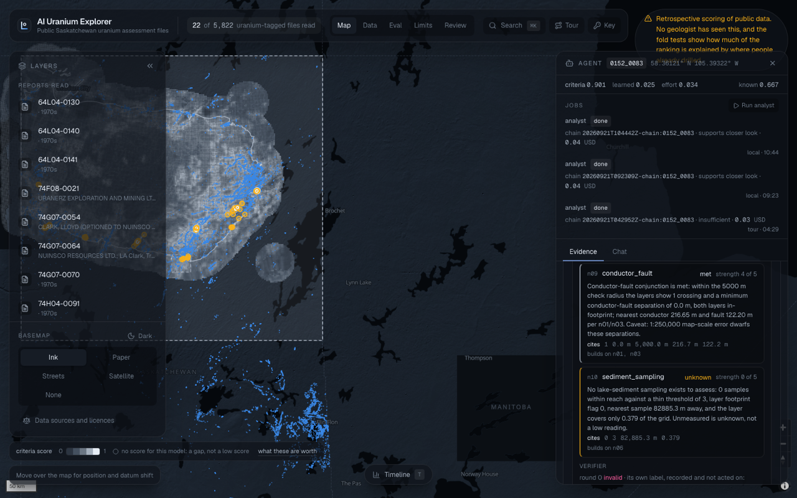
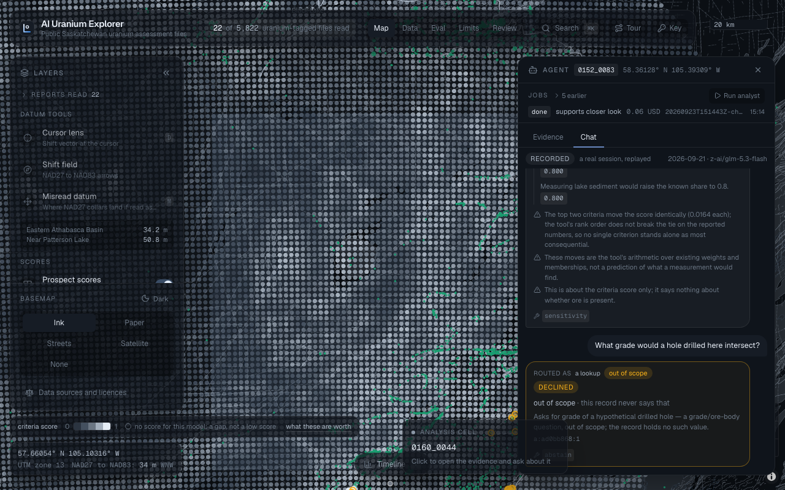
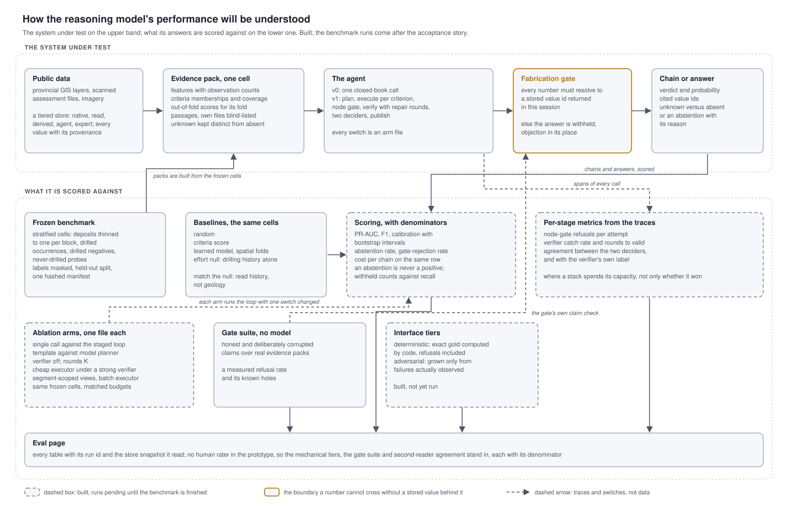

# AI Uranium Explorer

AI Uranium Explorer reads public Saskatchewan uranium records, provincial GIS layers and scanned assessment
reports, into a checked and traceable store, and scores 2 km cells over the Athabasca Basin three ways beside
a null model built from exploration effort alone. An agent sits beside each cell and can only speak from the
same tools the scores were computed from: every number it states is checked against a stored value before it
is shown, and an answer that fails is withheld with the objection in its place. It is a prototype on public
data; it gives no drilling advice, and no geologist has reviewed it.

*The dashboard on the Compose stack: the criteria score drawn over the basin, the enabled cell 0152_0083 selected, and the evidence rail showing its scores, its background jobs and the analyst's chain, node by node, with the values each node cites.*

## Features

- **A tiered store** (DuckDB locally, PostGIS for serving): `native` holds public layers as published,
  `read` holds what a model read out of scanned pages with the page, box and quote for every value,
  `derived` holds the grid, features and scores, `agent` holds chains and conversations, and `expert`
  holds what a geologist states. A value never moves up a tier without its provenance.
- **Data and readiness**: 21 registered sources with their licences, a 2 km grid over the basin, 25
  features with observation counts, and a readiness gate that says what covers what before any score.
- **Three scores and a null**: a knowledge-driven criteria score, a learned model under spatial folds, and
  an effort model built from where people already drilled. The gap between the last two is the headline.
- **Reading**: a batch reader over assessment files, and the extractor agent that adds a second model
  family's reading, compares value by value, and queues disagreements for review.
- **The analyst**: a staged loop over one cell (plan, execute per criterion, a deterministic node gate,
  a verifier with repair rounds, two deciders, publish), every node a status and cited value ids.
- **The interface agent**: routes a question to a fixed kind, plans deterministic tool calls, abstains with
  a reason, records an insight, or invokes the analyst as a background job.
- **The fabrication gate**: every number an agent states must resolve to a stored value id returned in
  that session, or the answer is withheld with the objection shown in its place.
- **An MCP server, an API with roles and jobs, and the dashboard** with its ten-step guided tour, which
  replays a recorded agent session so the room never waits on a model.

*The tour's replayed session: each turn shows the route it took, the values it cites as chips that open the
stored value, and a refusal with its reason where the store cannot answer.*

## Agentic design implementation

*What runs, and how it is judged. Dashed nodes are built and wait on the benchmark runs.*

The agents are built as a system that can be scored, not as a chat to admire. The upper row is what runs for
one cell; the lower row is what every answer is judged against. The pieces are in place; the benchmark runs
come next, and every table lands on the Eval page with its run id and store snapshot.

- **A frozen benchmark, UraniumBench**: a stratified subset of cells (known deposits thinned to one per
  block, drilled occurrences, drilled negatives, never-drilled probes), each with a frozen evidence pack,
  out-of-fold scores for its fold, its own label masked and its own files blind-listed, and a held-out
  split opened only at the end. One hashed manifest before any prompt is tuned.
- **The bar it must clear**: random, the criteria score, the learned model and the effort null on the
  same rows. An agent that merely matches the effort null has read drilling history, not geology.
- **Metrics with denominators**: PR-AUC, F1 and calibration with bootstrap intervals; the abstention rate
  and the gate-rejection rate beside them, because an abstention is never a positive and an answer the
  gate withheld counts against recall. Cost per chain sits on the same row.
- **Per-stage metrics from the traces**: node-gate refusals per attempt, the verifier's catch rate and
  rounds to valid, agreement between the two deciders and with the verifier's own label. They say where
  a stack's capacity is spent, not only whether it won.
- **The ablation matrix as arm files**: single call against the staged loop, template against model
  planner, verifier off, rounds K, cheap executor under a strong verifier, segment-scoped views, and the
  rest, all on the same frozen cells at matched budgets.
- **The gate suite**: honest and deliberately corrupted claims over real evidence packs, no model in the
  loop, so the fabrication check has a measured refusal rate and known holes.
- **The interface tiers**: a deterministic tier with exact gold computed by code, including questions
  whose right answer is a refusal, and an adversarial tier grown only from failures actually observed.

What is deliberately absent from the prototype is a human rater: there is no geologist on the project, so
the mechanical tiers, the gate suite and the second-reader agreement stand in, each with its denominator.

## Quick start

The analytics store is not in git. A fresh clone first pulls a seed pack from the URL it is published at (an
`s3://` prefix or an `https://` directory; every file is hash-checked), or places one at
`pipeline/data/seed/latest`.

    cd pipeline && uv sync && uv run ue store seed pull <url>

With Docker, from the repository root:

    docker compose up -d --build        # the app unpacks the pack on first start and serves on http://localhost:8787

Without Docker:

    cd pipeline
    uv run ue store seed unpack data/seed/latest
    uv run ue prospect serve            # http://localhost:8787: the site, the evidence record, the chat, /docs
    cd ../web && npm install && npm run dev    # the site on http://localhost:5173 during development

The map, the scores, the layers and the tour are static files and work with nothing running; the evidence
panel and the chat need the service. The chat needs a model key in the repository's `.env` (gitignored; see `.env.example`): an OpenRouter
key for the default `auto` backend, which is API first (a `vendor/model` id to OpenRouter, a `claude-*` id
to OpenRouter's Anthropic listing, a `gpt-*` id to OpenAI), or an OpenAI key with `--backend openai`. The public seed pack holds only redistributable tables, so document readings and analyst chains
appear only when the private pack is unpacked instead.

## The repository

    pipeline/             Python 3.13 with uv; the command is `uv run ue ...` (`ue --help` lists the groups)
    pipeline/knowledge/   the criteria table, the handbook, the data inventory, the enabled cells, the dated discoveries
    pipeline/configs/     analyst arms, benchmark specs, reader configurations
    pipeline/migrations/  the serving-database schema (Alembic)
    web/                  Vite + React + MapLibre: the map, the evidence rail, the chat; the data, Eval, limits and review pages
    gold/                 the held-out lock and the hand-keyed gold pages (none keyed yet)

Read GUIDE.md for how it works, control by control and stage by stage, and PRD.md for what it is, what it must
do, and what is left.

## Data and licences

Every source, its licence and whether it may be redistributed is listed in the inventory
(`pipeline/knowledge/data_inventory.toml`) and rendered in the app under "Data sources and licences"; each
layer carries its own licence. Provincial layers come from the Government of Saskatchewan under its open data
licence, the NTS grid under the Open Government Licence - Canada, imagery from Copernicus and the USGS, and
basemap tiles from OpenFreeMap on OpenStreetMap data. Assessment report PDFs carry no named licence: they are
read locally and never served, and their page images stay out of git. The public seed pack holds only
redistributable tables.

## Licence

The code and documents in this repository are under the MIT licence (see LICENSE). The data keeps the licences
of its sources.
